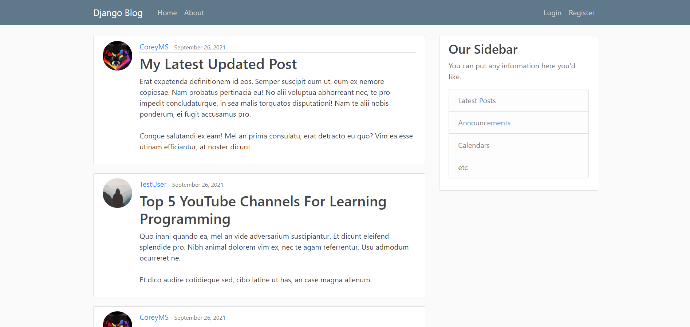

# Blog-Post
•	Created a full stack blogging web application using Django framework, where users can create, edit, delete different posts  
•	Used SQLite database for testing and PostgreSQL for production to store user information  
•	Used HTML, CSS and Bootstrap for front end development

